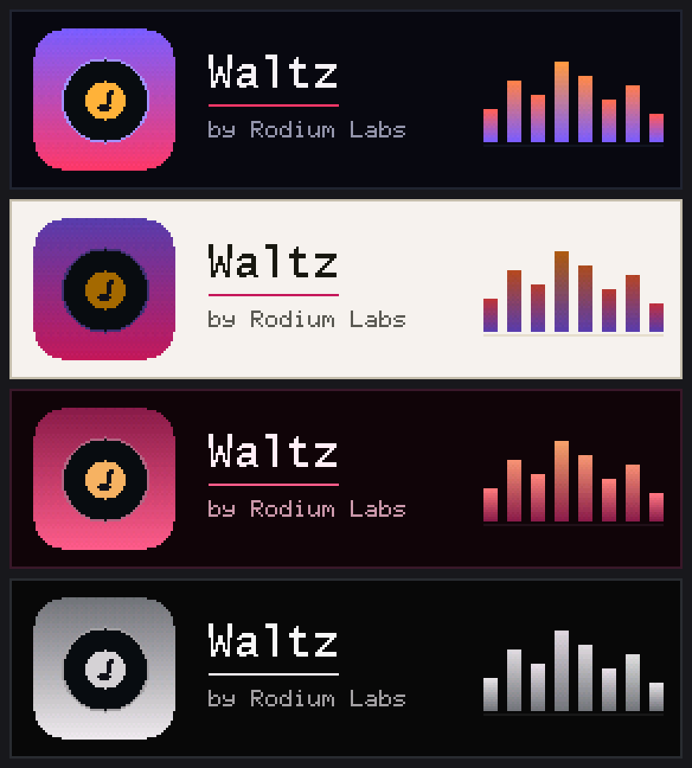
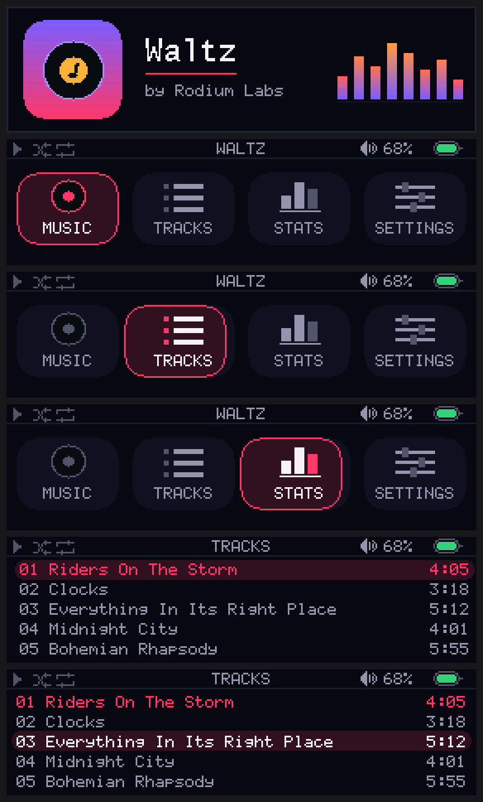
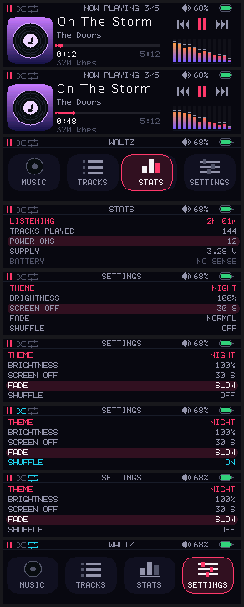
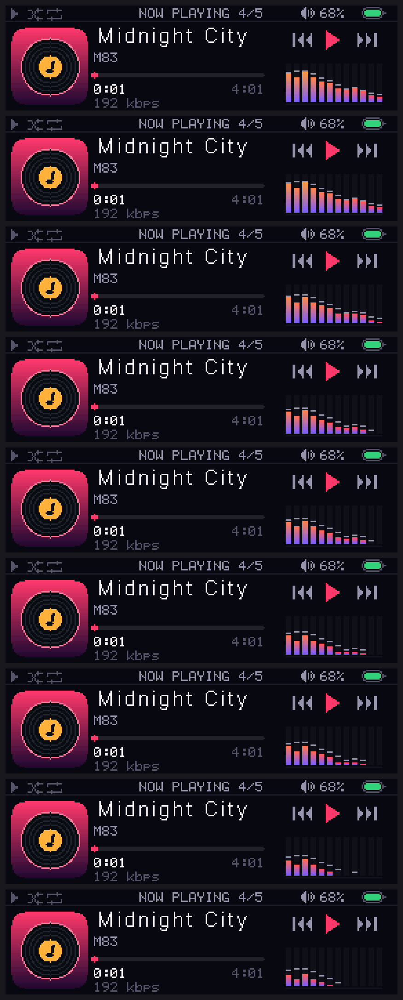
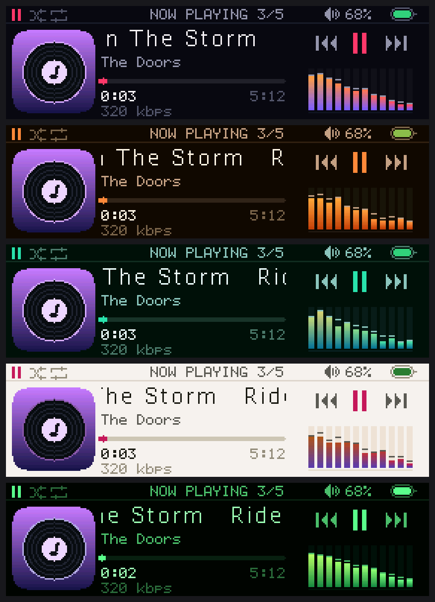
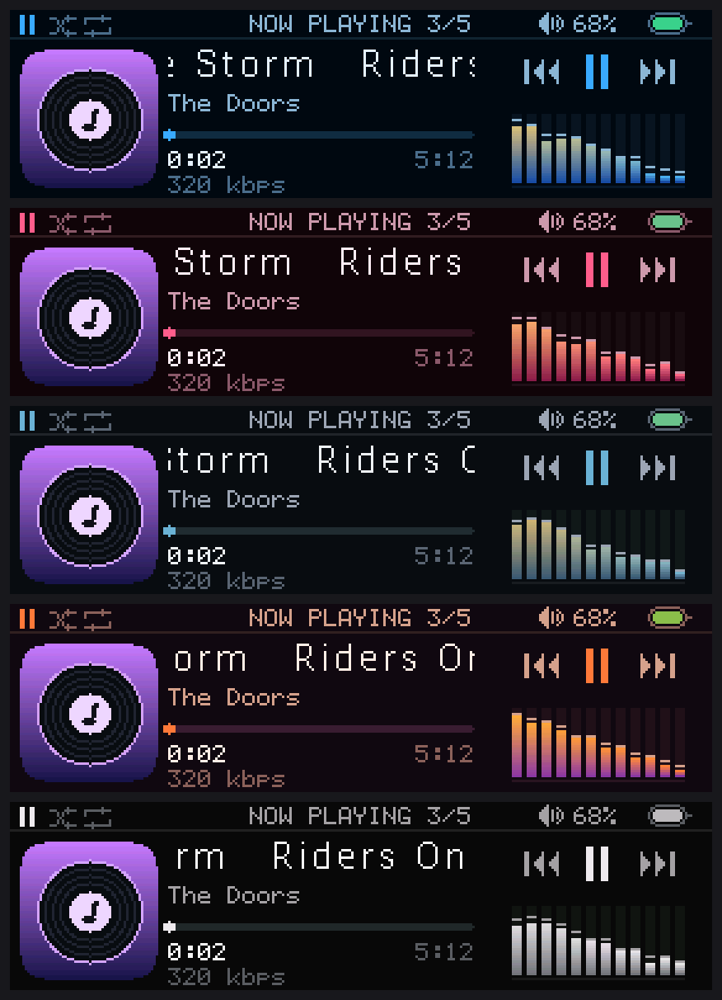

# Waltz

An MP3 player by **Rodium Labs**, built on an **STM32F401 Black Pill** driving a
**2.25" 76x284 narrow-bar TFT (ST7789P3, 4-wire SPI)**, run on its side as a
284x76 letterbox.

This is the display + UI half of the player. Playback is mocked for now: the
transport, level meter and playlist run off timers so the whole screen can be
exercised without an SD card or a decoder attached.



*The splash in four of the themes.*



*Splash, the home screen, the track list, the player.*



*Player, settings, and the play-mode chord flipping shuffle then repeat.*

## Wiring

The panel is a 3.3 V part - do not feed it 5 V.

| Module | Black Pill | Function |
| ------ | ---------- | -------- |
| GND    | G          | |
| VCC    | 3V3        | 2.8 - 3.3 V |
| SCL    | PA5        | SPI1_SCK (AF5) |
| SDA    | PA7        | SPI1_MOSI (AF5) |
| RES    | PB1        | GPIO out |
| DC     | PB0        | GPIO out |
| CS     | PA4        | GPIO out |
| BLK    | PB10       | TIM2_CH3, 1 kHz PWM brightness |

Five buttons, each tying its pin to GND - internal pull-ups, no external parts.
All on GPIOA so a scan is one `IDR` read, and clear of the I2S2 (PB12/13/15) and
SPI3 SD (PB3/4/5, PA15) pins the audio side will want later.

| Button | Pin | |
| ------ | --- | - |
| VOL-   | PA0 | some Black Pill revisions already have a KEY button here |
| PREV   | PA1 | |
| PLAY   | PA2 | |
| NEXT   | PA3 | |
| VOL+   | PA6 | SPI1_MISO, free because the panel is write-only |

Onboard LED on PC13 blinks once a second as a heartbeat.

SPI1 runs at 21 MHz (PCLK2 84 MHz / 4). A full 284x76 frame is 43 kB, so 16 ms;
the UI only repaints the blocks that changed. Drop `BaudRatePrescaler` in
`MX_SPI1_Init()` to `_8` if long jumpers start showing noise.

The backlight on this module is **active low**: BLK pulled low lights it. That is
what `ST7789_BLK_ACTIVE_LOW` handles, and `st7789_backlight()` compensates so 0
always means dark.

## Pin map

Everything in use today, and what the audio side has reserved.

| Pin | Use | Peripheral |
| --- | --- | ---------- |
| PA0 | VOL- button | GPIO in, pull-up |
| PA1 | PREV button | GPIO in, pull-up |
| PA2 | PLAY button | GPIO in, pull-up |
| PA3 | NEXT button | GPIO in, pull-up |
| PA4 | panel CS | GPIO out |
| PA5 | panel SCL | SPI1_SCK, AF5 |
| PA6 | VOL+ button | GPIO in, pull-up |
| PA7 | panel SDA | SPI1_MOSI, AF5 |
| PA13 | SWDIO | debug |
| PA14 | SWCLK | debug |
| PB0 | panel DC | GPIO out |
| PB1 | panel RES | GPIO out |
| PB10 | panel BLK | TIM2_CH3, 1 kHz PWM |
| PC13 | onboard LED | GPIO out, heartbeat |
| PH0 / PH1 | 25 MHz crystal | HSE |
| - | supply measurement | ADC1 internal VREFINT, no pin |

Free, and what they are earmarked for:

| Pin | Planned |
| --- | ------- |
| PB12 / PB13 / PB15 | I2S2 - WS / CK / SD to a PCM5102A |
| PB3 / PB4 / PB5 / PA15 | SPI3 - SCK / MISO / MOSI / CS to a microSD |
| PB6 | where VOL+ moves if a battery divider is ever needed on PA6 |
| PA8 / PA9 / PA10 / PB7 / PB8 / PB9 / PB14 / PC14 / PC15 | unclaimed |
| PA11 / PA12 | USB - left alone |
| PB2 | BOOT1, has a pull-down on the board - avoid |

PB11 does not exist on this package, and note that PB3 doubles as SWO: using it
for SPI3 costs trace output but not SWD, which stays on PA13/PA14.

## Build

```bash
cmake --preset Debug
cmake --build --preset Debug
```

Needs `arm-none-eabi-gcc` from STM32CubeCLT plus `ninja` on `PATH`. Output lands
in `build/Debug/` as `.elf`, `.hex` and `.bin`.

Current footprint: **32 kB flash of 256 kB, 11 kB RAM of 64 kB** - the renderer
paints in bands rather than keeping a 42 kB framebuffer, which leaves room for a
Helix MP3 decoder later.

## Flash

With an ST-Link on SWD:

```bash
/opt/ST/STM32CubeCLT_1.20.0/STM32CubeProgrammer/bin/STM32_Programmer_CLI -c port=SWD -w build/Debug/waltz.elf -rst
```

Or over USB DFU - hold BOOT0, tap NRST, release BOOT0:

```bash
dfu-util -a 0 -s 0x08000000:leave -D build/Debug/waltz.bin
```

## What this panel actually needed

Bringing the module up took a while, so here is the record - all of it lives in
`st7789.h` and `gfx.h` as flags with the reasoning in their comments.

| Symptom | Cause | Flag |
| ------- | ----- | ---- |
| Lit during init, faded out at the splash | BLK is active low | `ST7789_BLK_ACTIVE_LOW 1` |
| Plain white forever, backlight fine | CS held low across the whole init lost command framing; this controller wants CS pulsed per command | `wr_cmd_args()` in `st7789.c` |
| Colours wrong in every combination | The pixel path widened SPI to 16-bit frames per burst and switched back for commands. Nothing else drives ST7789 that way, and it mangled the data. Now plain byte-wide DMA. | `GFX_WIRE_SWAP 1` |
| - | With the data path fixed the panel wants no colour tricks at all | `ST7789_BGR 0`, `ST7789_INVERT 0` |

Two things that did **not** turn out to be the problem, in case they look
tempting: SPI clock speed (1.3 MHz behaved exactly like 21 MHz) and the
CASET/RASET offsets (82/18 portrait, 18/82 landscape - correct from the start).

### Diagnostics

Three bring-up screens are still in the tree, all off by default. Each one
answers a different question and none of them needs test equipment.

* `LCD_GRAM_PROBE` in `main.c` - writes straight to the 240x320 frame memory,
  ignoring the offsets. Floods it red, then splits columns and rows into thirds.
  Answers *is the panel executing commands at all, and where is its window?*
* `LCD_COLOR_SWEEP` in `main.c` - walks all eight colour formats the controller
  can be in (byte order x BGR x inversion), four seconds each, numbered on
  screen. Answers *which format is this panel?* without anyone having to name a
  hue. This is what finally settled it.
* `UI_PANEL_CHECK` in `player_ui.h` - six labelled colour strips held for 15 s.

The splash itself is a permanent self-test: a 1 px border around all four edges
(any missing edge means the offsets are wrong) plus R/G/B swatches and the
offsets in use.

## Layout

284x76 is a letterbox - 47 characters of the 6x8 font wide but only nine rows
tall - so the screen is three columns rather than a stack:

```
+--------+---------------------------+------------------+
|        | title                     | clock   battery  |
| cover  | artist                    |                  |
| 64x64  | progress                  | level meter      |
|        | 1:23              4:05    |                  |
|        | shuf prev play next rep   | volume           |
+--------+---------------------------+ bitrate    3/5   |
```

Each block is an independent redraw region, so only the ones whose data changed
get repainted - that is what keeps the banded renderer cheap. Row constants and
the palette live in `Core/Inc/Ui/theme.h`.

Portrait (76x284) still works - set `ST7789_ROTATION` to 0 in `st7789.h` - but
the layout above is built for landscape and will not rearrange itself.

## Screens

Boot lands on the **home screen** with nothing playing - three tiles, PREV/NEXT
to pick, PLAY to enter.

| Tile | |
| ---- | - |
| MUSIC | the player |
| TRACKS | track list |
| STATS | lifetime counters and supply readout |
| SETTINGS | settings |

A 12-row **status bar** sits above every screen: playback state, shuffle and
repeat flags, the screen name, volume, battery. Keeping it global is why the
player below it fits in 64 rows.

Every list wraps - past the last row is the first one again, in the menus and
across the home tiles.

## Motion



*Pushing into a screen, sampled every 30 ms.*

Transitions carry the hierarchy: going into something pushes it in from the
right, coming back slides it away again. Selection does not jump either - the
home focus ring and the menu highlight slide to their new place.

Animation is time-based rather than frame-based, so a slow frame shortens the
animation instead of stretching it. Ease-out cubic over 240 ms for screens,
160 ms for selection.

None of it needs a framebuffer. `gfx_translate()` shifts the coordinate origin
the primitives draw against, so a transition paints the outgoing screen at one
offset and the incoming one at another inside a single banded flush, and neither
screen's paint function knows it is being moved.

The one thing that had to change to make that safe was clipping. It used to fall
out of the band for free, which held while every paint function owned exactly
the region it was flushed with - and broke the moment the marquee was reused
inside a whole-screen repaint, where it happily drew its text across the album
art. `gfx_clip()` makes it explicit.

## Controls

PLAY is the only button with a long press, and it always means the same two
things: tap to act, hold to go back.

**Player**

| | |
| - | - |
| PLAY short | play / pause |
| PLAY held | back to home |
| PREV | previous track, or restart the current one past 3 s |
| NEXT | next track |
| PREV / NEXT held | seek in 5 s steps, repeating |
| VOL-/VOL+ | one step, auto-repeating when held |

**List and settings** - the same scrollable menu, so they behave alike

| | |
| - | - |
| PREV / NEXT | move the selection, auto-repeating |
| PLAY short | play the highlighted track, or change the highlighted setting |
| PLAY held | back to home; from settings this is also the save point |
| VOL-/VOL+ | volume, shown in the status bar |

**Anywhere**

| | |
| - | - |
| VOL- + VOL+ together | cycle the play mode: off, shuffle, repeat, both |

That chord exists because every short and long press across the five buttons was
already spoken for, and digging into settings to flip shuffle is too far to
reach. Cycling all four states with one gesture is what makes a single chord
enough. The volume pair is the safe one to overload: the first press of the pair
still lands a volume step, and a stray 2 % is harmless where a stray track skip
would not be. The status bar flags are the feedback.

Auto-repeat matters more than it sounds: without it, walking the volume from
20 % to 80 % is thirty presses. First repeat after 400 ms, then every 100 ms,
speeding to 50 ms after a second.

`input.c` polls the port every 5 ms from the main loop and debounces on four
agreeing samples - no EXTI, no per-button timer. A press lasts 50-200 ms and the
worst-case blit is 16 ms, so nothing is missed.

## Settings

Theme, backlight brightness, screen-off delay, fade speed, shuffle, repeat. PLAY
changes the highlighted row.

**Screen off** blanks the backlight after 15 s / 30 s / 1 min / 5 min of no
button, or never. It *fades* rather than switching - a panel that snaps to black
reads as a fault. **Fade** sets how fast: instant, fast, normal or slow (10 ms to
a full second). The ramp is stepped from the main loop rather than slept through,
so a button press can interrupt a fade half way down. Playback carries on
regardless; it is a music player. The press that wakes the screen is swallowed,
so reaching for the volume does not skip a track.

**Stored in flash.** Leaving the settings screen appends a 16-byte record to
sector 5 (the last 128 kB, well clear of the 40 kB firmware). Flash bits only go
1 -> 0 without an erase and erasing that sector stalls the CPU for about a
second, so instead of rewriting one slot each save appends and the loader takes
the last valid record - 8192 saves before an erase is needed. See
`Core/Src/settings.c`.

## Themes




*The player screen in all ten schemes.*

Ten of them in `Core/Src/Ui/theme.c`: `NIGHT`, `AMBER`, `MINT`, `PAPER` (light),
`TERMINAL`, `OCEAN`, `ROSE`, `SLATE`, `SUNSET` and `MONO`. Switch from the
settings page; the change applies to every screen immediately.

The splash follows the stored theme too, which is why `Settings_Load()` runs
before `Ui_Splash()` in `main()` - load it later and the splash comes up in the
defaults and then the first real screen snaps to the stored palette. The splash
fade also uses the stored brightness and the FADE step, so it comes up at
whatever speed the rest of the UI moves at.

The palette used to be a set of `COL_*` macros. It is now a `ui_theme_t` table
with a pointer to the active entry, and the `COL_*` names were kept as macros
that dereference it - so the drawing code did not change at all when themes
landed. Per-track cover gradients stay compile-time constants in `player.c`,
because they belong to the track rather than the theme.

**Nothing may cache a `COL_*` value.** They are runtime lookups now, so a copy
taken at init goes stale the moment the theme changes - which is exactly how the
marquee ended up painting the old background behind the title and artist, a
visible box that did not match the rest of the screen. Resolve colours inside the
paint function.

`PAPER` is in there deliberately: a light scheme is what catches any place the UI
quietly assumed a dark background. It has already earned its keep twice - it
caught the level meter's groove being *dimmed towards black* (subtle on a dark
theme, solid bars on a light one; it now mixes from the background towards the
card colour instead), and it made the stale-marquee bug obvious.

`MONO` is greyscale except for red, because a low-battery warning that reads as
just another shade of grey would be a regression.

Nothing about the theme is baked in at build time - the whole table costs 10 x 26
bytes of flash.

## Stats

| Row | Where it comes from |
| --- | ------------------- |
| LISTENING | real seconds of playback, counted from `HAL_GetTick` deltas rather than transport ticks - so it stays honest while `DEMO_TIME_SCALE` runs the transport fast |
| TRACKS PLAYED | every call through `begin_track()` |
| POWER ONS | incremented by `Settings_Load()` |
| SUPPLY | measured, see below |
| BATTERY | `NO SENSE` - no cell, and no pin to sense one |
| CHARGE CYCLES | `-`, same reason |

Counters live in the same flash record as the settings and are committed every
five minutes of playback. There is no power-down warning to flush on, so yanking
the cable can cost the last few minutes - which beats a flash write every second.

### What can and cannot be measured

`SUPPLY` is real. With no external parts the ADC can still read its own 1.21 V
reference, and VDDA falls out of that:

```
VDDA = 4095 * 1210 mV / adc_reading
```

The F4 ships no factory calibration for VREFINT (unlike L4/G4), so the datasheet
typical is all there is - about +-2.5 %, so +-80 mV. That makes it a **brown-out
gauge, not a fuel gauge**, which is genuinely useful when running off an
ST-Link's weak 3.3 V rail. The status bar battery icon shows this rail mapped
2.90 V - 3.30 V onto 0-100 %.

Battery percentage and charge cycles need a cell and a divider, and **there is no
ADC pin left**: on this package ADC1 only reaches PA0-PA7, PB0 and PB1, and every
one of those is a button or a display line. To fix it, move VOL+ off PA6 to PB6 -
then PA6 is ADC1_IN6 and free for the divider. `Power_HasBatterySense()` is the
switch that lights those two rows up.

### Memory cost

The whole stats feature is noise on this part: about 100 bytes of RAM (12 for the
counters, ~90 for the ADC handle) and 6 kB of flash, most of it HAL ADC. Current
totals are **44 kB flash of 256 kB and 11.5 kB RAM of 64 kB**.

The one thing that will actually squeeze RAM is the MP3 decoder: roughly 30 kB
for Helix plus 9 kB of PCM double-buffer. The lever for that is already in place -
`GFX_BAND_H` can drop from 16 to 4, taking the band buffer from 9 kB to 2.3 kB
with no change to any drawing code.

## Source layout

```
Core/Src/main.c            clocks, SPI1, TIM2, main loop
Core/Src/player.c          mocked transport + level meter (playlist table here)
Core/Src/input.c           five buttons -> debounced semantic events
Core/Src/settings.c        settings + lifetime counters in the last flash sector
Core/Src/power.c           supply rail via the ADC's internal reference
Core/Src/Ui/player_ui.c    all five screens, one paint function per block
Core/Src/Ui/theme.c        the ten colour schemes
Core/Inc/Ui/theme.h        palette and block geometry
Libs/st7789/               panel driver: init, windowing, DMA blits
Libs/gfx/                  banded RGB565 renderer + 1bpp fonts
Assets/Icons/              hand-drawn 1bpp glyphs (note, headphones, speaker)
Tools/uisim/               renders the UI on the host - see below
```

Fonts are the tables from [afiskon/stm32-ssd1306](https://github.com/afiskon/stm32-ssd1306)
(MIT), same as the SSD1306 build of this player, so text renders identically on
both. `Font_Roboto16` is Roboto Thin (Apache 2.0).

## Iterating on the UI without hardware

`gfx.c`, `player_ui.c` and `player.c` have no HAL dependencies beyond
`HAL_GetTick`/`HAL_Delay`, so they compile for the host with a stubbed panel:

```bash
./Tools/uisim/run.sh
```

That rewrites `docs/ui-preview.png` from the current sources. The stub also
aborts on any blit that falls outside the panel, so it catches layout overruns
that would silently corrupt the display.

## Not done yet

* Audio. The F401 has no DAC, so this wants an I2S codec (PCM5102A, MAX98357A)
  on SPI2/I2S2, or a VS1053B doing the decoding in hardware.
* SD card and a real playlist.
* An up-next card. It was in the portrait layout; 76 rows have no room for it
  alongside the transport row.
* Real playback timing. `DEMO_TIME_SCALE` runs the transport 4x while there is
  nothing to actually decode; set it to 1 for wall-clock.

## License

MIT - see [LICENSE](LICENSE).

Third-party code keeps its own terms:

* `Drivers/` - ST's CMSIS headers and the STM32F4xx HAL, BSD-3-Clause, with
  ST's own `LICENSE.txt` files kept alongside them.
* `Libs/gfx/Src/gfx_fonts.c` - bitmap tables from
  [afiskon/stm32-ssd1306](https://github.com/afiskon/stm32-ssd1306), MIT.
* `Font_Roboto16` in the same file - Roboto Thin by Google, Apache License 2.0.
