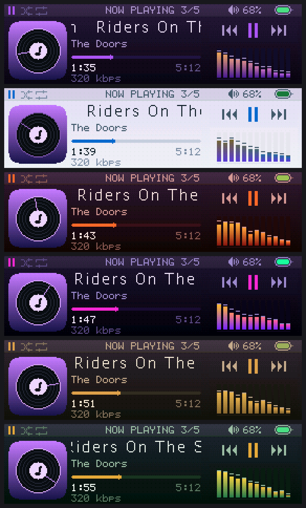

# Waltz

An MP3 player by **Rodium Labs**, built on an **STM32F401 Black Pill** driving a
**2.25" 76x284 narrow-bar TFT (ST7789P3, 4-wire SPI)**, run on its side as a
284x76 letterbox.

This is the display + UI half of the player. Playback is mocked for now: the
transport, level meter and playlist run off timers so the whole screen can be
exercised without an SD card or a decoder attached.


*Splash, the home screen, the track list, the player.*

## Wiring

The panel is a 3.3 V part - do not feed it 5 V.

| Module | Black Pill | Function |
| ------ | ---------- | -------- |
| GND    | G          | |
| VCC    | 3V3        | 2.8 - 3.3 V |
| SCL    | PA5        | SPI1_SCK (AF5) |
| SDA    | PA7        | SPI1_MOSI (AF5) |
| RES    | PB1        | GPIO out |
| DC     | PB0        | GPIO out |
| CS     | PA4        | GPIO out |
| BLK    | PB10       | TIM2_CH3, 1 kHz PWM brightness |

Five buttons, each tying its pin to GND - internal pull-ups, no external parts.
All on GPIOA so a scan is one `IDR` read, and clear of the I2S2 (PB12/13/15) and
SPI3 SD (PB3/4/5, PA15) pins the audio side will want later.

| Button | Pin | |
| ------ | --- | - |
| VOL-   | PA0 | some Black Pill revisions already have a KEY button here |
| PREV   | PA1 | |
| PLAY   | PA2 | |
| NEXT   | PA3 | |
| VOL+   | PA6 | SPI1_MISO, free because the panel is write-only |

Onboard LED on PC13 blinks once a second as a heartbeat.

SPI1 runs at 42 MHz (PCLK2 84 MHz / 2), the part's ceiling. That is for vsync
rather than throughput: the panel scans a column every 48.8 us, and a frame has
to be written ahead of that scan to land without a tear. Drop
`BaudRatePrescaler` in `MX_SPI1_Init()` to `_4` if long jumpers start showing
noise; that was the known-good setting, and it tears.

The backlight on this module is **active low**: BLK pulled low lights it.
`ST7789_BLK_ACTIVE_LOW` handles that, and `st7789_backlight()` compensates so 0
always means dark.

## Pin map

Everything in use today, and what the audio side has reserved.

| Pin | Use | Peripheral |
| --- | --- | ---------- |
| PA0 | VOL- button | GPIO in, pull-up |
| PA1 | PREV button | GPIO in, pull-up |
| PA2 | PLAY button | GPIO in, pull-up |
| PA3 | NEXT button | GPIO in, pull-up |
| PA4 | panel CS | GPIO out |
| PA5 | panel SCL | SPI1_SCK, AF5 |
| PA6 | VOL+ button | GPIO in, pull-up |
| PA7 | panel SDA | SPI1_MOSI, AF5 |
| PA13 | SWDIO | debug |
| PA14 | SWCLK | debug |
| PB0 | panel DC | GPIO out |
| PB1 | panel RES | GPIO out |
| PB10 | panel BLK | TIM2_CH3, 1 kHz PWM |
| PC13 | onboard LED | GPIO out, heartbeat |
| PH0 / PH1 | 25 MHz crystal | HSE |
| - | supply measurement | ADC1 internal VREFINT, no pin |

Free, and what they are earmarked for:

| Pin | Planned |
| --- | ------- |
| PB12 / PB13 / PB15 | I2S2 - WS / CK / SD to a PCM5102A |
| PB3 / PB4 / PB5 / PA15 | SPI3 - SCK / MISO / MOSI / CS to a microSD |
| PB6 | where VOL+ moves if a battery divider is ever needed on PA6 |
| PA8 / PA9 / PA10 / PB7 / PB8 / PB9 / PB14 / PC14 / PC15 | unclaimed |
| PA11 / PA12 | USB - left alone |
| PB2 | BOOT1, has a pull-down on the board - avoid |

PB11 does not exist on this package, and note that PB3 doubles as SWO: using it
for SPI3 costs trace output but not SWD, which stays on PA13/PA14.

## Build

```bash
cmake --preset Release
cmake --build --preset Release
```

Needs `arm-none-eabi-gcc` from STM32CubeCLT plus `ninja` on `PATH`. Output lands
in `build/Release/` as `.elf`, `.hex` and `.bin`.

**Flash the Release build.** The Debug preset is `-O0`, and on this part that is
not a detail: drawing a screen costs 26.9 ms unoptimised against 8.5 ms at `-Os`,
which is the difference between 24 fps and 92. The `Debug` preset is for when a
debugger is actually attached.

Current footprint: **38 kB flash of 256 kB, 24 kB RAM of 64 kB**. The renderer
paints in bands rather than keeping a 42 kB framebuffer, which is what leaves room
for a decoder. Of that RAM, 19 kB is two band buffers and 2.5 kB a gradient row
table - both bought frame rate, and both are one constant away from being smaller
and slower.

## Flash

With an ST-Link on SWD:

```bash
/opt/ST/STM32CubeCLT_1.20.0/STM32CubeProgrammer/bin/STM32_Programmer_CLI -c port=SWD -w build/Release/waltz.elf -rst
```

Or over USB DFU - hold BOOT0, tap NRST, release BOOT0:

```bash
dfu-util -a 0 -s 0x08000000:leave -D build/Release/waltz.bin
```

## Layout

284x76 is a letterbox - 47 characters of the 6x8 font wide but only nine rows
tall - so the screen is three columns rather than a stack:

```
+-------------------------------------------------------+
| shuf rep      NOW PLAYING 3/5       vol      battery  |
+--------+---------------------------+------------------+
|        | title                     | prev play next   |
| cover  | artist                    |                  |
| 64x64  | progress                  | level meter      |
|        | 0:12              4:05    |                  |
|        | 320 kbps                  |                  |
+--------+---------------------------+------------------+
```

Each block is an independent redraw region, so only the ones whose data changed
get repainted. Row constants and the palette live in `Core/Inc/Ui/theme.h`.

Portrait (76x284) still works - set `ST7789_ROTATION` to 0 in `st7789.h` - but
the layout above is built for landscape and will not rearrange itself.

## Screens

Boot lands on the **home screen** with nothing playing - four tiles, PREV/NEXT to
pick, PLAY to enter.

| Tile | |
| ---- | - |
| MUSIC | the player |
| TRACKS | track list |
| STATS | lifetime counters and supply readout |
| SETTINGS | settings |


*The three list screens: tracks, stats, settings.*

A 12-row **status bar** sits above every screen: playback state, shuffle and
repeat flags, the screen name, volume, battery. Keeping it global is why the
player below it fits in 64 rows.

Every list wraps - past the last row is the first one again, in the menus and
across the home tiles. Long lists get a position rail on the right, since
wrapping otherwise leaves no sense of where you are.

A sixth screen has no tile: the **message screen**, which any button dismisses.
It is where the no-card and no-tracks states will land.


Transitions carry the hierarchy - going into something pushes it in from the
right, coming back slides it away - and the cover turns while a track plays.
Ease-out cubic, 240 ms for screens and 160 ms for selection, timed off the clock
rather than counted in frames. `gfx_translate()` is what makes it possible with
no framebuffer: it shifts the origin the primitives draw against, so a transition
paints both screens at different offsets inside one banded flush.

## Controls

PLAY is the only button with a long press, and it always means the same two
things: tap to act, hold to go back.

**Player**

| | |
| - | - |
| PLAY short | play / pause |
| PLAY held | back to home |
| PREV | previous track, or restart the current one past 3 s |
| NEXT | next track |
| PREV / NEXT held | seek in 5 s steps, repeating |
| VOL-/VOL+ | one step, auto-repeating when held |

**Track list and stats**

| | |
| - | - |
| PREV / NEXT | move the selection, auto-repeating |
| PLAY short | play the highlighted track |
| PLAY held | back to home |
| VOL-/VOL+ | volume, on the card |

**Settings** - PLAY steps into a row rather than cycling it in place. THEME has
sixteen schemes, and overshooting one used to mean fifteen more presses to come
back around.

| | |
| - | - |
| PREV / NEXT | move the selection, or step the value when inside a row |
| PLAY short | enter or leave the row; on/off rows just flip |
| PLAY held | leave the row, or leave settings - which is the save point |
| VOL-/VOL+ | volume, on the card |

The row being edited says so: its plate brightens and chevrons appear either side
of the value.

**Anywhere**

| | |
| - | - |
| VOL- + VOL+ together | cycle the play mode: off, shuffle, repeat, both |
| any button, screen off | wakes only - it does not also act |


*The player, settings, and the chord flipping shuffle then repeat.*

## Settings

Theme, backlight brightness, screen-off delay, fade speed, shuffle, repeat, and
an INFO row that opens an about screen rather than holding a value.

**Screen off** blanks the backlight after 15 s / 30 s / 1 min / 5 min of no
button, or never. It *fades* rather than switching - a panel that snaps to black
reads as a fault. **Fade** sets how fast: instant, fast, normal or slow (10 ms to
a full second). The ramp is stepped from the main loop rather than slept through,
so a button press can interrupt a fade half way down. Playback carries on
regardless; it is a music player.

**Stored in flash.** Leaving the settings screen appends a 16-byte record to
sector 5 (the last 128 kB, well clear of the firmware). Flash bits only go 1 -> 0
without an erase, and erasing that sector stalls the CPU for about a second, so
instead of rewriting one slot each save appends and the loader takes the last
valid record - 8192 saves before an erase is needed. See `Core/Src/settings.c`.

## Themes



*Six of the sixteen. The rest are in [ui-themes-a](docs/ui-themes-a.png) and
[ui-themes-b](docs/ui-themes-b.png).*

Sixteen schemes in `Core/Src/Ui/theme.c`: `NIGHT`, `AMBER`, `MINT`, `PAPER`
(light), `TERMINAL`, `OCEAN`, `ROSE`, `SLATE`, `SUNSET`, `MONO`, `VIOLET`,
`FROST` (light), `EMBER`, `NEON`, `SEPIA` and `FOREST`. Switch from the settings
page; the change applies to every screen immediately.

The palette is a `ui_theme_t` table with a pointer to the active entry, and the
`COL_*` names are macros that dereference it - so no drawing code had to change
when themes landed. Per-track cover gradients stay compile-time constants in
`player.c`, because they belong to the track rather than the theme.

A new scheme needs three text weights that stay legible against `bg` and `card`,
three accents that stay apart from each other, and a `bg` far enough from mid
grey that a frosted panel drawn over it still reads as a panel - the backdrop
takes its tint from the cover art, so a scheme sitting halfway has nowhere to
go.

## Stats

| Row | Where it comes from |
| --- | ------------------- |
| LISTENING | real seconds of playback, from `HAL_GetTick` deltas rather than transport ticks - so it stays honest while `DEMO_TIME_SCALE` runs the transport fast |
| TRACKS PLAYED | every call through `begin_track()` |
| POWER ONS | incremented by `Settings_Load()` |
| SUPPLY | the rail, measured against the ADC's internal reference |
| BATTERY | `NO SENSE` - no cell, and no pin to sense one |
| CHARGE CYCLES | `-`, same reason |

Counters live in the same flash record as the settings and are committed every
five minutes of playback. There is no power-down warning to flush on, so yanking
the cable can cost the last few minutes - which beats a flash write every second.

`SUPPLY` is real but coarse. With no external parts the ADC can still read its
own 1.21 V reference, and VDDA falls out of that:

```
VDDA = 4095 * 1210 mV / adc_reading
```

The F4 ships no factory VREFINT calibration, so the datasheet typical is all
there is - about +-2.5 %, or +-80 mV. That makes it a **brown-out gauge, not a
fuel gauge**, which is genuinely useful when running off an ST-Link's weak rail.

Battery percentage and charge cycles need a cell, a divider, and **an ADC pin
that does not exist yet**: on this package ADC1 only reaches PA0-PA7, PB0 and
PB1, and every one of those is a button or a display line. Move VOL+ off PA6 to
PB6 and PA6 becomes ADC1_IN6, free for the divider. `Power_HasBatterySense()` is
the switch that lights those two rows up, and the low-battery warning with them.

## Source layout

```
Core/Src/main.c            clocks, SPI1, TIM2, main loop
Core/Src/player.c          mocked transport + level meter (playlist table here)
Core/Src/input.c           five buttons -> debounced semantic events
Core/Src/settings.c        settings + lifetime counters in the last flash sector
Core/Src/power.c           supply rail via the ADC's internal reference
Core/Src/Ui/player_ui.c    every screen, one paint function per block
Core/Src/Ui/theme.c        the sixteen colour schemes
Core/Inc/Ui/theme.h        palette and block geometry
Libs/st7789/               panel driver: init, windowing, DMA blits, scanline read
Libs/gfx/                  banded RGB565 renderer + 1bpp fonts
Assets/Icons/              hand-drawn 1bpp glyphs
Tools/uisim/               renders the UI on the host - see below
```

Fonts are the tables from [afiskon/stm32-ssd1306](https://github.com/afiskon/stm32-ssd1306)
(MIT), same as the SSD1306 build of this player, so text renders identically on
both. `Font_Roboto16` is Roboto Thin (Apache 2.0).

## Iterating on the UI without hardware

`gfx.c`, `player_ui.c` and `player.c` have no HAL dependencies beyond
`HAL_GetTick`/`HAL_Delay`, so they compile for the host with a stubbed panel:

```bash
./Tools/uisim/run.sh
```

That rewrites every image in `docs/` from the current sources. The stub aborts on
any blit that falls outside the panel, so it catches layout overruns that would
silently corrupt the display.

Three scripts turn the raw frames into something reviewable, all standard library
only:

| | |
|---|---|
| `sheet.py` | frames -> one scaled contact sheet |
| `zoom.py` | crops blown up 8-10x, for judging glyphs and icons |
| `gif.py` | a frame run -> a looping GIF, median-cut palette and LZW |

The scripted button presses drive the real event handler, so the scenes go
wherever the firmware would. Home navigation goes through `home_pick()`, which
counts presses against the tile the UI is on - the strip wraps, and scenes that
assumed a tile index silently filmed the wrong screen for a while.

## Not done yet

* Audio. The F401 has no DAC, so this wants an I2S codec (PCM5102A, MAX98357A)
  on SPI2/I2S2, or a VS1053B doing the decoding in hardware.
* SD card and a real playlist. The list screen is ready for it - rail, wrapping,
  scroll-into-view - but the model has to be windowed rather than held in RAM:
  500 tracks at 48 bytes of title and artist is 24 kB, and there is not 24 kB to
  spare.
* **A level meter that follows the music.** What is on screen now is decorative -
  `tick_level()` in `player.c` drives it from an LCG and a fixed beat, with
  `bar_shape[]` giving the bars a downward slope so it reads like a spectrum.
  Pausing drops it to zero, which is most of why it looks connected. Two ways to
  make it real, and neither is expensive:
  - A 256 point real FFT over the decoded PCM. One per MP3 frame is one per
    26 ms at 44.1 kHz, which on an M4 with an FPU is nothing; q15 fixed point
    keeps it near a kilobyte.
  - Or no FFT at all. MP3 is already a frequency domain codec, so Helix holds
    the spectrum before it synthesises PCM - reading the granule's scalefactor
    band energies gives twelve bars almost free. There is no published API for
    that, so it means reaching into the decoder's internals, which is a patch we
    would carry rather than a supported hook.
* An up-next card. It was in the portrait layout; 76 rows have no room for it
  alongside the transport row.
* Real playback timing. `DEMO_TIME_SCALE` runs the transport 4x while there is
  nothing to actually decode; set it to 1 for wall-clock.

Deliberately not planned: an equaliser. Not the display above - the control that
changes the sound. Five bands of biquad over 44.1 kHz stereo on top of an MP3
decode is tight on an 84 MHz core, and the meter gets the same visible payoff for
a fraction of the work.

## License

MIT - see [LICENSE](LICENSE).

Third-party code keeps its own terms:

* `Drivers/` - ST's CMSIS headers and the STM32F4xx HAL, BSD-3-Clause, with
  ST's own `LICENSE.txt` files kept alongside them.
* `Libs/gfx/Src/gfx_fonts.c` - bitmap tables from
  [afiskon/stm32-ssd1306](https://github.com/afiskon/stm32-ssd1306), MIT.
* `Font_Roboto16` in the same file - Roboto Thin by Google, Apache License 2.0.
